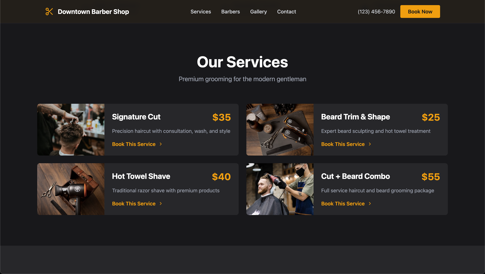

# Downtown Barber Shop Website

A modern barbershop landing page showcasing services, team profiles, and booking capabilities.

**[Live Site](https://downtown-barbershop.netlify.app)** | **Tech Stack:** React, Tailwind CSS

**Key Features:** Auto-rotating hero carousel • Responsive design with mobile nav • Smooth scroll navigation • Service pricing cards • Instagram gallery grid

<b>Built With</b>

**Note:** Demonstration project with placeholder content.

## Table of Contents
- [Technical Details](#technical-details)
- [Screenshots](#screenshots)
- [Roadmap](#roadmap)
- [License](#license)
- [Questions](#questions)

## Technical Details

**Frontend**
- React functional components with hooks (useState, useEffect, useRef)
- Single-file structure for landing page
- Tailwind CSS utility classes with dark theme and amber accents
- Lucide React icons

**Interactive Features**
- Auto-rotating carousel with manual controls
- Click-outside detection using React refs
- Smooth scroll API navigation
- Touch-optimized mobile interactions
- Responsive hamburger menu

**Performance**
- Vite for fast builds and HMR
- Optimized CDN images
- Minimal bundle size

**UI/UX**
- Mobile-first responsive design
- Fixed header with backdrop blur
- Hover effects and smooth animations
- Click-to-call functionality

## Screenshots

<b>View More Screenshots</b>

## Roadmap
- [x] Screenshots and production deployment
- [ ] Contact form with backend
- [ ] Online booking system
- [ ] Google Maps integration
- [ ] Instagram API connection
- [ ] Auto-rotating testimonials
- [ ] Blog section
- [ ] Multi-language support
- [ ] Admin dashboard

## License

This project is licensed under the [MIT](https://opensource.org/licenses/MIT) license.

## Questions
For questions, email me at devkyoriku@gmail.com.